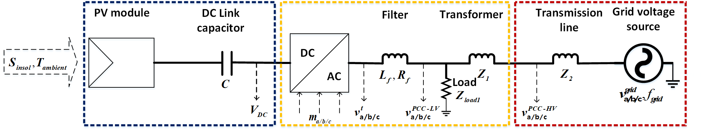
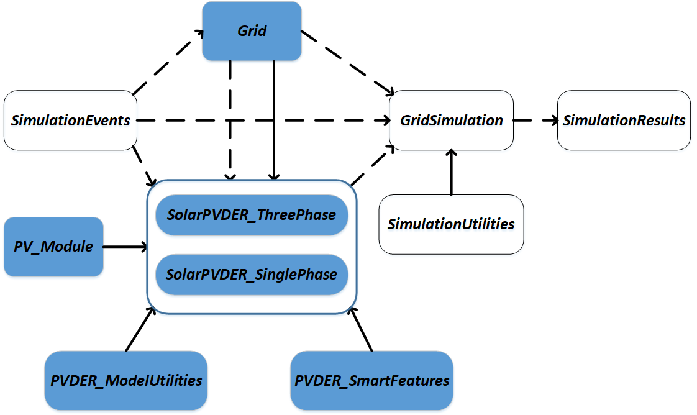

**Status:** Expect regular updates and bug fixes.

# Tool for simulating dynamics of PV-DER
[](https://travis-ci.org/sibyjackgrove/SolarPV-DER-simulation-utility)

[](https://www.codefactor.io/repository/github/tdcosim/solarpv-der-simulation-utility)

Solar photovoltaic distributed energy resources (PV-DER) are power electronic inverter based generation (IBG) connected to the electric power distribution system (eg. roof top solar PV systems). This tool can be used to simulate the dynamics of a single DER connected to a stiff voltage source as shown in the following schematic:



## Basics
The dynamics of the DER are modelled using dynamic phasors. Detailed description of the concepts behind this tool can be found in the IEEE publication [Dynamic Modeling of Solar PV Systems for Distribution System Stability Analysis](https://www.researchgate.net/publication/333985171_Dynamic_Modeling_of_Solar_PV_Systems_for_Distribution_System_Stability_Analysis) and detailed list of equations can be found in the [Model specification document.](docs/PV_DER_model_specification_rev3.docx)

### Features
The following features are available currently:
1. Single phase, three phase balanced, and three phase unbalanced (phase voltages may be unbalanced) DER models.
2. Run simulation in stand alone mode with internal grid voltage source (stiff) model.
3. Run simulation in loop mode where grid voltage is supplied every time step by a third party program.
4. Customize all aspects of the model through a [JSON](config_der.json) file which provides access to parameters in all the model components. 
5. Visualize or retrieve simulation results for voltages, current, active, and reactive power.
5. Introduce solar insolation events (in all modes), grid voltage, and frequency change events (in stand alone mode).
6. Retrieve and modify model parameters from a third party program.
7. Following smart inverter features are available: Low/High voltage ride through (LVRT/HVRT), Low frequency ride through (LFRT), and Volt-VAR control logic.

## Links
* Source code repository: https://github.com/sibyjackgrove/SolarPV-DER-simulation-tool
* API Documentation: https://solarpv-der-simulation-utility.readthedocs.io/en/latest/
* Additional documentation: [Description of attributes and methods](docs/PVDER_flags_variables_methods.md)

## Installation

Dependencies:

- SciPy >= 1.2.1
- Numpy >= 1.16.2
- Matlplotlib >= 3.0.3

Install latest release:
```
pip install pvder
```

Install from source:
```
git clone https://github.com/tdcosim/SolarPV-DER-simulation-tool.git
cd SolarPV-DER-simulation-tool
pip install -e .
```

## Use cases
Following projects are using Solar PV-DER simulation tool:
1. [Argonne Transmission and Distribution systems Co-Simulation tool (TDcoSim)](https://github.com/tdcosim/TDcoSim)
2. [OpenAI Gym Distributed Energy Resource Environment  (Gym-DER)](https://github.com/sibyjackgrove/gym-SolarPVDER-environment)

## Using the tool
This tool can be imported as a normal python module:

```python
import pvder
```

### Using the stand alone single phase DER model with 10 kW power rating
The following steps are required. Additional documentation on attributes and methods are available [here](docs/PVDER_flags_variables_methods.md).
1. First import the following classes:
```
from pvder.DER_components_single_phase import SolarPV_DER_SinglePhase
from pvder.grid_components import Grid
from pvder.dynamic_simulation import DynamicSimulation
from pvder.simulation_events import SimulationEvents
from pvder.simulation_utilities import SimulationResults
```
1. Create a **_SimulationEvents_** object: This object is used to add or remove disturbance events occurs during the simulation.
```
events = SimulationEvents()
```
2. Create a **Grid** object: This object describes the steady state model for the grid voltage source. It needs to be supplied with an **_SimulationEvents_** object.
```
grid = Grid(events=events)
```
3. Create a **SolarPV_DER_SinglePhase** or **SolarPV_DER_ThreePhase** object: This object describes the dynamic DER model. It needs both an **_SimulationEvents_** object, and a path name for JSON file containing the DER configuration parameters.  It also needs a **Grid** object in stand alone mode). Additionaly either the power rating of the DER or the id for the parameter dictionary should be provided.
```
PV_DER = SolarPV_DER_SinglePhase(events=events,configFile=r'config_der.json',gridModel=grid,derId= '10',standAlone = True)
```
4. Create a **DynamicSimulation** object: This object runs the simulation and stores the solution. It takes **_SimulationEvents_**, **Grid** and, **SolarPV_DER_SinglePhase** objects as arguments.
```
sim = DynamicSimulation(grid_model=grid,PV_model=PV_DER,events = events)
```
5. Create a **SimulationResults** object: This object is used to visualize the simulation results.
```
results = SimulationResults(simulation = sim)
```
6. Add an event (for e.g. solar insolation change at 10.0 s):
```
events.add_solar_event(10,90)
```
7. Specify simulation flags (for e.g. set the DEBUG_SIMULATION and DEBUG_POWER flag to true to observe the power at each time step.):
```
sim.DEBUG_SIMULATION = False
sim.DEBUG_POWER = False
```
8. Specify simulation stop time (for e.g. 20.0 s):
```
sim.tStop = 20.0
```
9. Run the simulation:
```
sim.run_simulation()
```
10. Visualize the results (for e.g. the power output at PCC-LV side):
```
results.PER_UNIT = False
results.plot_DER_simulation(plot_type='active_power_Ppv_Pac_PCC')
```

### Examples
Try out Jupyter notebooks with usage examples in Google Colab:

Basic usage:
[](https://colab.research.google.com/github/sibyjackgrove/SolarPV-DER-simulation-tool/blob/master/examples/PV-DER_usage_example.ipynb)

Running simulation in loop mode:
[](https://github.com/sibyjackgrove/SolarPV-DER-simulation-tool/blob/master/examples/PV-DER_usage_example_loop_mode.ipynb)

Updating model parameters:
[](https://github.com/sibyjackgrove/SolarPV-DER-simulation-tool/blob/master/examples/PV-DER_parameter_update_example.ipynb)

Voltage anomaly, ride through, and momentary cessation:
[](https://github.com/sibyjackgrove/SolarPV-DER-simulation-tool/blob/master/examples/PV-DER_usage_example_LVRT_momentary_cessation_with_recovery.ipynb)

Frequency anomaly, ride through, and trip:
[](https://github.com/sibyjackgrove/SolarPV-DER-simulation-tool/blob/master/examples/PV-DER_usage_example_LFRT_with_trip.ipynb)

## Module details
A schematic of the relationship between differen classes in the module is shown in the figure below:


## Issues
Please feel free to raise an issue for bugs or feature requests.

## Who is responsible?

**Core developer:**
- Siby Jose Plathottam splathottam@anl.gov

**Contributor:**

- Karthikeyan Balasubramaniam kbalasubramaniam@anl.gov

## Acknowledgement

This project was supported by Kemal Celik, [U.S. DOE Office of Electricity, Solar Energy Technology Office](https://www.energy.gov/eere/solar/solar-energy-technologies-office) through the [SuNLaMP](https://www.energy.gov/eere/solar/sunshot-national-laboratory-multiyear-partnership-sunlamp) program.

The authors would like to acknowledge [Shrirang Abhyankar](https://github.com/abhyshr) and Puspal Hazra for their contribution.

## Citation
If you use this code please cite it as:
```
@misc{pvder,
  title = {{SolarPV-DER-simulation-tool}: A simulation tool for or solar photovoltaic distributed energy resources},
  author = "{Siby Jose Plathottam,Karthikeyan Balasubramaniam}",
  howpublished = {\url{https://github.com/sibyjackgrove/SolarPV-DER-simulation-tool}},
  url = "https://github.com/sibyjackgrove/SolarPV-DER-simulation-tool",
  year = 2019,
  note = "[Online; accessed 19-March-2019]"
}
```
### Copyright and License
Copyright © 2019, UChicago Argonne, LLC

Photovoltaic Distributed Energy Resource (PV-DER) Simulation tool is distributed under the terms of [BSD-3 OSS License.](LICENSE)
